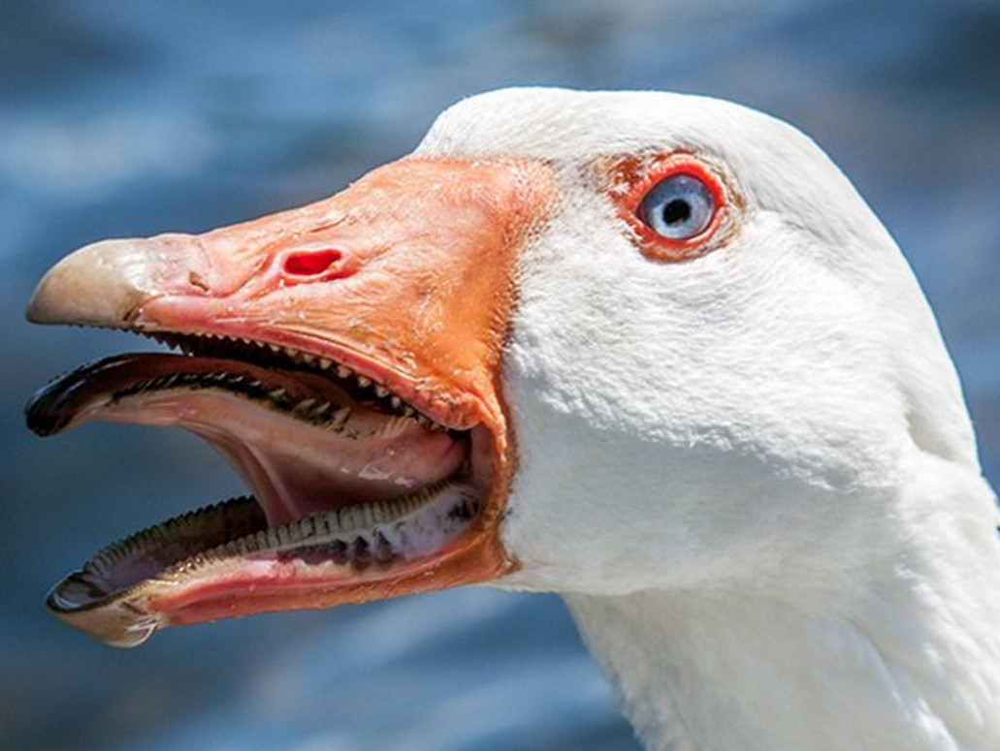

exclude: true

```{r setup, include=FALSE}
options(htmltools.dir.version = FALSE)
knitr::opts_chunk$set(echo = FALSE, message = FALSE, warning = FALSE,
                      #fig.retina = 3, fig.align = "center", fig.height = 8,  fig.width = 12
                        fig.width=9, fig.height=4, fig.retina=3, out.width = "100%")
library(tidyverse)
source(here::here("data_analysis", "preprocessing.r"))

here::here("r_function") %>% 
  list.files() %>% 
  map(~source(here::here("r_function", .)))
```

---

class: inverse, center, bottom

background-image: url(fig/joel_bg.jpg)
background-size: cover

### In honour of Joel’s birthday we present… 
# An examination into the beliefs and feelings toward<br>**Joel Le Forestier**: A survey study


---

# Intro  

In celebration of the birth of **Joel Le Forestier**, we created [a survey of Joel-centric questions](https://utorontopsych.az1.qualtrics.com/jfe/form/SV_0TcVdupdXsRkJJc)<sup>1</sup>. 

`r nrow(dataset)` people from the Intergroup Relations Lab, SAM Lab, SPRQL, and other friends came together to triangulate the meaning of Joel.  


.footnote[
[1] Raw data file and r-syntax files are available at [Github](https://github.com/psy218/measure_of_joel).  
]

---
class: inverse, middle, center

# Results

---

# What do we think of when we think of *Joel*? 

```{r}
library(wordcloud)
joel_words %>% 
  filter(word != "gay") %>% 
  count(word, sort = T) %>% 
  with(wordcloud::wordcloud(word,
                            freq = n,
                            min.freq = 1,
                            max.words = 100,
                            random.order = F,
                            colors = c(viridis::viridis(n = 10, option = "C", begin = .3), "#D55E00")))
```

---

# How amazing and wonderful is Joel?  

<br></br>
1: Joel is amazing and wonderful!   
2: Joel is SO amazing and wonderful!  
3: Joel is SO VERY amazing and wonderful!  
4: Joel is literally the MOST amazing and wonderful!  
5: There is absolutely no doubt in my mind: Joel is THE most amazing and wonderful person EVER.  
6: Words cannot fully describe JUST HOW amazing and wonderful Joel is. This cannot be measured with a 6-point Likert scale, you fools. 

---
# How amazing and wonderful is Joel?  


```{r}
dataset %>% 
  mutate(joel_amazingness = factor(joel_amazingness,
                                   levels = 1:6)) %>% 
  count(joel_amazingness, .drop = FALSE) %>% 
  drop_na(joel_amazingness) %>% 
  mutate(prop = round( n / sum(n, na.rm = T)*100)) %>% 
  inner_join(joel_amazingness %>% 
               mutate(option_level = factor(option_level,
                                                levels = 1:6)), 
             by = c(joel_amazingness = "option_level")) %>% 
  # mutate_at("joel_amazingness", as.factor) %>% 
  mutate(joel_amazingness = factor(joel_amazingness,
                                   levels = joel_amazingness,
                                   labels = stringr::str_wrap(option_text, 20))) %>%
  bar_graph("joel_amazingness")
  # pie_chart(., "joel_amazingness")

```

---

# Which of the following Joels would you most love to see?    

```{r}
dataset %>% 
  count(joel_version) %>% 
  inner_join(joel_version, by = c(joel_version = "option_level")) %>% 
  arrange(n) %>% 
  mutate(prop = round( n / sum(n)*100),
         joel_version = factor(joel_version,
                               levels = joel_version,
                               labels = stringr::str_wrap(option_text, 20))) %>%
  # mutate_at("joel_version", as.factor) %>% 
  bar_graph("joel_version") 
  # pie_chart("joel_version")
```

---
# If Joel was a character in a book, choose up to two genres he would appear in  
```{r}
dataset %>%
  select(pid, starts_with("joel_movie-")) %>%
  pivot_longer(starts_with("joel_movie-"),
               names_to = "genre",
               values_to = "genre_count",
               names_prefix = "joel_movie-",
               values_drop_na = T) %>%
  count(genre) %>%
  mutate(genre = str_replace(genre, "Darkcomedy", "Dark Comedy"),
         prop = round( n / sum(n)*100)) %>% 
  mutate(option_text = genre,
         genre = fct_reorder(genre, n)) %>% 
  bar_graph("genre") 
```

---
class: inverse, top, left

background-image: url(fig/four_season.jpg)
background-size: cover 

# Which of the following seasons best describes Joel?     

---
# Which of the following seasons best describes Joel?     
```{r}
dataset %>% 
  count(joel_season) %>% 
  mutate(prop = round( n / sum(n)*100)) %>% 
  inner_join(joel_season, by = c(joel_season = "option_level")) %>% 
  mutate(joel_season = factor(joel_season,
                              levels = joel_season, 
                              labels = stringr::str_to_title(option_text)),
         option_text = str_to_title(option_text)) %>% 
  pie_chart("joel_season")
```

<!-- --- -->

<!-- # Which of the following seasons best describes Joel?    -->
<!-- ```{r} -->
<!-- dataset %>%  -->
<!--   count(joel_season) %>%  -->
<!--   mutate(prop = round( n / sum(n)*100)) %>%  -->
<!--   inner_join(joel_season, by = c(joel_season = "option_level")) %>%  -->
<!--   mutate(joel_season = factor(joel_season, -->
<!--                               levels = joel_season,  -->
<!--                               labels = option_text), -->
<!--          option_text = str_to_title(option_text)) %>% -->
<!--   bar_graph("joel_season") -->
<!-- ``` -->


---

# Which Joel-related conspiracy is most likely true?    

```{r}
dataset %>% 
  count(joel_conspiracy) %>% 
  mutate(prop = round( n / sum(n)*100)) %>% 
  inner_join(joel_conspiracy, by = c(joel_conspiracy = "option_level")) %>% 
  arrange(n) %>% 
  mutate(joel_conspiracy = factor(joel_conspiracy,
                              levels = joel_conspiracy, 
                              labels = stringr::str_wrap(option_text, 20)),
         option_text = str_to_title(option_text)) %>% 
  bar_graph("joel_conspiracy")
```

---
# Who would win in a battle of wits: **Joel** or a **goose**?   
.pull-left[
<!--  -->
```{r}

```

]
.pull-right[
<!--  -->
```{r}

```
]

---
# Who would win in a battle of wits: **Joel** or a **goose**?   
```{r}
dataset %>% 
  mutate(joel_goose = factor(joel_goose, 
                             levels = 1:4)) %>% 
  count(joel_goose, .drop = FALSE) %>% 
  drop_na(joel_goose) %>% 
  mutate(prop = round( n / sum(n)*100)) %>% 
  inner_join(joel_goose %>% 
               mutate(option_level = factor(option_level)), by = c(joel_goose = "option_level")) %>% 
  arrange(n) %>% 
  mutate(joel_goose = factor(joel_goose,
                              levels = joel_goose, 
                              labels = stringr::str_wrap(option_text, 20)),
         option_text = str_to_title(option_text)) %>% 
  bar_graph("joel_goose")
```


---
# How many times do you want to wish Joel a Happy Birthday?   

We asked everyone how many times they’d like to wish you a happy birthday. Collectively, we’d like to wish you a happy birthday `r sum(dataset$joel_bdaywishes, na.rm = T)` times.”
```{r}
dataset %>% 
  mutate(bday_wish_max = ifelse(joel_bdaywishes == max(joel_bdaywishes, na.rm = T), "max", "other")) %>% 
  ggplot(aes(x = reorder(factor(pid), -joel_bdaywishes),
             y = joel_bdaywishes,
             fill = bday_wish_max)) +
  geom_bar(stat = "identity",
           position = position_dodge(.8)) +
  geom_hline(aes(yintercept = mean(dataset$joel_bdaywishes, na.rm = T)),
             linetype = "dashed") +
  geom_text(aes(label = joel_bdaywishes),
              position = position_dodge(.8),
              hjust = -0.25) +
  scale_x_discrete(breaks = NULL,
                   "") +
  scale_y_continuous("Number of B-Day Wishes",
                     # breaks = unique(dataset$joel_bdaywishes),
                     trans = "log10") +
  scale_fill_manual(guide = "none",
                    values = c("#D55E00", "#999999")) +
  theme_classic() +
  coord_flip() 
```


---
# Birthday Wishes   
```{r}
bday_msgs %>% 
  dplyr::select(from = "subj_name", message = "bday_msg") %>% 
  DT::datatable()
```
---
# Birthday Wishes   
```{r}
bday_words %>% 
  count(word, sort = T) %>% 
  with(wordcloud::wordcloud(word,
                            freq = n,
                            min.freq = 1,
                            max.words = 100,
                            random.order = F,
                            colors = viridis::viridis(n = 30, option = "D")))
```


---
# Summary  

We examined the beliefs and feelings toward **Joel Le Forestier**. 
According to the `r nrow(dataset)` affiliates of Joel, ...
- Joel's level of amazing and wonderful cannot be neither fully described in words nor measured with a 6-point Likert scale
- Joel must learn to be fluent in Italian with a Sicillian accent  
- Joel is most likely to be a character in Dark comedy  
- Joel is like the Fall
- Joel's wise nature can be explained by his immortality and his 150 years on the earth
- Joel's chances of winning a battle of wits against a goose is inconclusive until more information about the goose is made available   


---
class: left, center 

background-image: url(fig/lily.jpeg)
background-position: right

.pull-left[
# Thank you!
]


